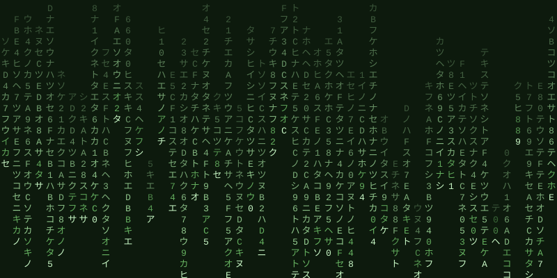

<div align="center">
  
  
</div>

```bash
fabrice@github:~$ whoami && uptime
```
```
Fabrice Terrasson · Senior Backend Engineer · SafeBrands (CentralNic Group)
Marseille, France · Provençal learner (rare dependency)
coding since 1999 — up 25 years, 0 planned reboots
```

```bash
fabrice@github:~$ ls -la skills/
```
```
backend/  php/symfony ████████████████ ∞%  · nestjs █████████████░░░ 85%  · fastapi ████████████░░░░ 80%  · perl ██████░░░░░░░░░░ 60%
data/     postgresql/mysql █████████████░░░ 85%  · nosql ██████████░░░░░░ 70%
infra/    linux/nginx/docker ████████████░░░░ 80%  · bind9 ████████░░░░░░░░ 60% (domain names)
api/      rest ████████████████ 95%  · soap ████████░░░░░░░░ 55% (on en parle plus)
```

```bash
fabrice@github:~$ git log --oneline --career && cat /proc/current_status
```
```
2008→now  feat: 17 years @ SafeBrands/CentralNic  ← still here
2007      refactor: teacher → fulltime dev (best career pivot ever)
2004      feat: prof de techno, Académie de Nice/PACA
1999      init: Walawa — php4, mysql3, apache, set-top box

LEGACY    : fluent — "ne touche pas ça, ça marche"
AI        : certified prompt engineer (yes, that's a thing now)
HOBBIES   : Advent of Code (December mood)
QUOTE     : "Pourquoi réinventer la roue alors qu'on peut y ajouter des jantes alu ?"
```

```bash
fabrice@github:~$ curl -s https://api.github.com/stats/fte
```


```bash
fabrice@github:~$ cat .env.contact && exit
```
```
LINKEDIN=https://www.linkedin.com/in/fabriceterrasson/
EMAIL=linkedin@575.be
# sudo cat /etc/shadow → Permission denied. (non, je ne mettrai pas la recette de la crème brûlée.)
```


